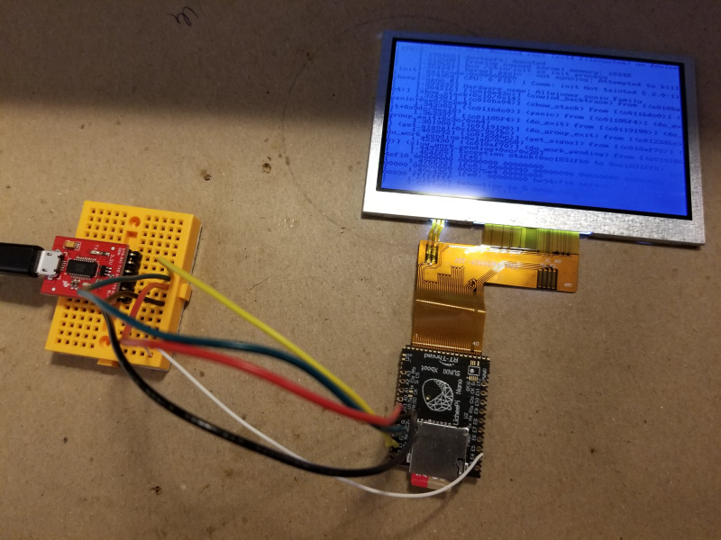

# Lichee Pi Nano Bootable Linux Image (Buildroot)



[Lichee Pi Nano](http://nano.lichee.pro/index.html) ([English article](https://www.cnx-software.com/2018/08/17/licheepi-nano-cheap-sd-card-sized-linux-board/)) is a very small single-board computer that is about the size of an SD card. It can run Linux. There is a good amount of official documentation on the [original manufacturer site](http://nano.lichee.pro/get_started/first_eye.html) (in Chinese, but easily readable thanks to Google Translate). However, the tooling used to build the full card/SPI-Flash images is mostly made up of custom shell scripts, and is not always easy to extend or maintain.

This repository contains a Buildroot config extension that allows all of those build steps to be handled via a single Buildroot `make` command. That means fully building the U-Boot image, Linux kernel, the rootfs image and the final partitioned binary image for flashing onto the bootable SD card (SPI-Flash support is possible but not handled here yet).

All the configuration is packaged as a `BR2_EXTERNAL` Buildroot extension to avoid the need to fork the entire Buildroot repo. You can fork this project or integrate it as a Git subtree to customize your own OS build on top of it as needed.

This effort heavily borrowed from the work done by the FunKey Zero project: https://github.com/Squonk42/buildroot-licheepi-zero/. The latter targets Lichee Pi Zero, a sibling board to the Nano, but I was able to adapt it for use with Nano, and also converted the content to be a `BR2_EXTERNAL` extension rather than a full Buildroot fork.

The config files should be reasonably readable, e.g. here is the main Buildroot defconfig file: [configs/licheepi_nano_defconfig](configs/licheepi_nano_defconfig). You will most likely need to update the Linux DTS (device tree) file to match your board usage, for which you can edit [suniv-f1c100s-licheepi-nano-custom.dts](board/licheepi_nano/suniv-f1c100s-licheepi-nano-custom.dts). Sample peripheral descriptions are listed in comments there - uncomment and modify what you need. This custom DTS file includes the original [suniv-f1c100s-licheepi-nano.dts](https://github.com/unframework/linux/blob/nano-5.11/arch/arm/boot/dts/suniv-f1c100s-licheepi-nano.dts) in the kernel tree, so you don't need to fork the kernel or duplicate code to make your local customizations. I may also set up an equivalent customizable U-Boot DTS file in the future.

Please also check out https://github.com/florpor/licheepi-nano which predates this repo but somehow I did not stumble upon until I finished my own config/porting/rebasing. Please consult that repo for possibly newer versions/patches/etc!

## Dependencies

- Vagrant (if building inside the VM)
  - vagrant-vbguest plugin
  - vagrant-disksize plugin
- Ubuntu Bionic or similar (see Vagrant VM)
- Buildroot 2020.02 (auto-downloaded by VM, otherwise see [project downloads page](https://buildroot.org/download.html))

Buildroot takes care of downloading any further dependencies automatically. Please note that I tested this only on the `2020.02` version of Buildroot so far.

## Building the Image

First, clone this repo:

```sh
git clone git@github.com:unframework/licheepi-nano-buildroot.git
```

If not using Vagrant, ensure build scripts are executable:

```sh
chmod a+x licheepi-nano-buildroot/board/licheepi_nano/*.sh
```

If using Vagrant VM to perform the build:

```sh
cd licheepi-nano-buildroot # location of this repo's files

# install required plugins
vagrant plugin install vagrant-vbguest
vagrant plugin install vagrant-disksize

vagrant up
vagrant ssh
```

Otherwise, download Buildroot and extract it into a folder that is separate from this repo's files. Please note that I have not tested it with newer Buildroot versions - you will likely need to [tweak some settings](https://github.com/unframework/licheepi-nano-buildroot/issues/18).

Before building, install these Ubuntu packages:

```sh
sudo apt-get install swig fakeroot devscripts python3-dev python3-distutils libssl-dev
```

If there are still error messages during later build, try installing these (sorry, did not clean up the list yet, some might be unnecessary):

```sh
sudo apt-get install -y chrpath gawk texinfo libsdl1.2-dev whiptail diffstat cpio libssl-dev
```

Now, if you are using Vagrant your main Buildroot checkout will be in `/home/vagrant/buildroot-2020.02`. Note that it is not the same folder as the location of this board-specific config repo (which would be `/vagrant` if using the Vagrant VM). The Buildroot folder will be the main spot where actual compilation happens, so chdir inside it:

```sh
# if not using Vagrant VM, cd <your_buildroot_folder>
cd /home/vagrant/buildroot-2020.02
```

Then, generate initial build configuration:

```sh
# if not using Vagrant VM, change "/vagrant" to be location of this repo's files
BR2_EXTERNAL=/vagrant make licheepi_nano_defconfig
```

The above generates a `.config` file in the Buildroot checkout folder - this is the build configuration for `make` later on. Customize it if needed:

```sh
make menuconfig
```

Proceed with the build:

```sh
make
```

The build may take 1.5 hours on a decent machine, or longer. For a faster build, try changing configuration to use external toolchain. I have tried building with Linaro GCC 7.5, but ran into crashes at time of `/sbin/init` invocation (issue with bundled glibc?).

A successful build will produce a `output/images` folder. That folder contains a `sdcard.img` file that can now be written to the bootable SD card. Note that if Vagrant VM is used, the `output/images/sdcard.img` file first needs to be copied back out to the host machine, since it is unlikely that your VM has direct access to the SD card writer.

Example command to write image to SD card on Linux host:

```sh
sudo dd if=YOUR_HOST_FOLDER/sdcard.img of=DEVICE # e.g. /dev/sd?, etc
```

On Windows, Rufus or Balena Etcher can be used, or another utility like that.

## Linux and U-Boot Versions

The built kernel is [a Linux fork based off 5.11](https://github.com/unframework/linux/commits/nano-5.11), with hardware-specific customizations. I have cherry-picked the original customizations from @Lichee-Pi Linux repo [nano-5.2-tf branch](https://github.com/torvalds/linux/compare/master...Lichee-Pi:nano-5.2-tf) and [nano-5.2-flash branch](https://github.com/torvalds/linux/compare/master...Lichee-Pi:nano-5.2-flash) (both based off Linux version 5.2) and added tiny fixes due to newer kernel version.

The built U-Boot is [a fork based off v2021.01](https://github.com/unframework/u-boot/commits/2021.01-f1c100s) with hardware-specific customizations, which I ported over from [the original @Lichee-Pi v2018.01 fork](https://github.com/Lichee-Pi/u-boot/commits/nano-v2018.01) referenced in the docs. By the way, the latter is actually itself a rebase of [an earlier repo branch maintained by @Icenowy](https://github.com/u-boot/u-boot/compare/master...Icenowy:f1c100s-spiflash). Splash screen support is not yet ported.

## LCD Screen Support

By default, the `suniv-f1c100s-licheepi-nano.dts` device tree expects a 800x480 TFT screen to be plugged into the 40-pin flex-PCB connector on the board. You can change this to be a 480x272 TFT screen - simply uncomment the `panel` block at line 14 in [suniv-f1c100s-licheepi-nano-custom.dts](board/licheepi_nano/suniv-f1c100s-licheepi-nano-custom.dts). This will override the `compatible` string for the driver and trigger the lower resolution (see also [original docs](http://nano.lichee.pro/build_sys/devicetree.html#lcd)).
